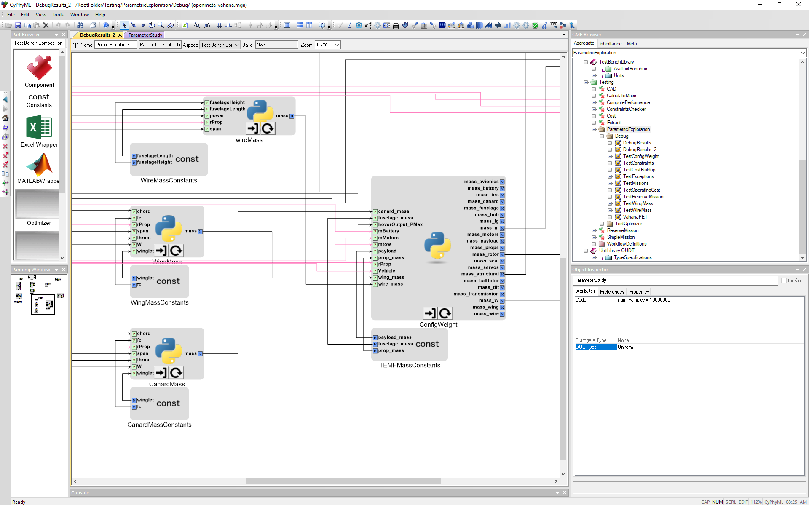

# OpenMETA-Vahana
An OpenMETA model for the conceptual design of an autonomous transport aircraft, inspired by the Vahana Project from A^3 by Airbus. The goal was to replicate the tradeoff study that was released by A^3. A CAD model has been added to supplement this analysis. This model has parametric rotation of the wings and canards, as well as changing total wing and canard length based on the design variable "rProp".

Figure 1 - Image of Creo Model [CENTER]

We converted the A^3's MATLAB Code to PythonWrapper Components which we then used as 'building blocks' in the OpenMETA environment. By transforming the problem presentation from a nested function structure into an exposed, linear, and modular structure, we gain the ability to easily swap out individual PythonWrapper Components and change connections between individual Components.

Figure 2 - A^3 MATLAB Code Structure [CENTER] <- Get a higher res image if possible

Figure 3 - A PET Composed of PythonWrapper Components [CENTER] <- Get a higher res image if possible

The PET above contains various OpenMETA structures, such as Constant Components, a Parameter Study, and PythonWrapper Components. Notice, that we still haven't translated A^3's fuselageMass.m and propMass.m files into PythonWrapper Components yet. Instead their values are contained inside Constant Components. Since we arbitrarily assigned a value of just 14 kg to prop_mass, the helicopter auto-rotation constraint will likely fail. but for now, we just want to generate some data for the tiltwing configuration. When we finish translating the final two MATLAB files into PythonWrapper Components, adding them will be simple: delete the constant block, add the PythonWrappers, and redraw the connections.

Figure 4 - Section of PET Dedicated to Mass Calculations [CENTER] <- Get a higher res image if possible

Now we can set the ranges of the design variables in the Parameter Study Component and run the Master Interpreter to generate some data. Let's set the Parameter Study to 1 million samples and run the PET.

2 hours later (Don't worry boss, I was ~~trying to set the world record for Chrome tabs open in a single browser~~ doing other work while this ran in the background)...

Here's a filtered subset of our data in the OpenMETA Visualizer - 397 points to be exact:

 <- Get a higher res image if possible

Figure 5 - Filtered PET Result in Visualizer

## References
[Vahana Configuration Trade Study Part - 1](https://vahana.aero/vahana-configuration-trade-study-part-i-47729eed1cdf)

[Vahana Configuration Trade Study Part - 2](https://vahana.aero/vahana-configuration-trade-study-part-ii-1edcdac8ad93)

[MATLAB Code](https://github.com/VahanaOpenSource/vahanaTradeStudy)
