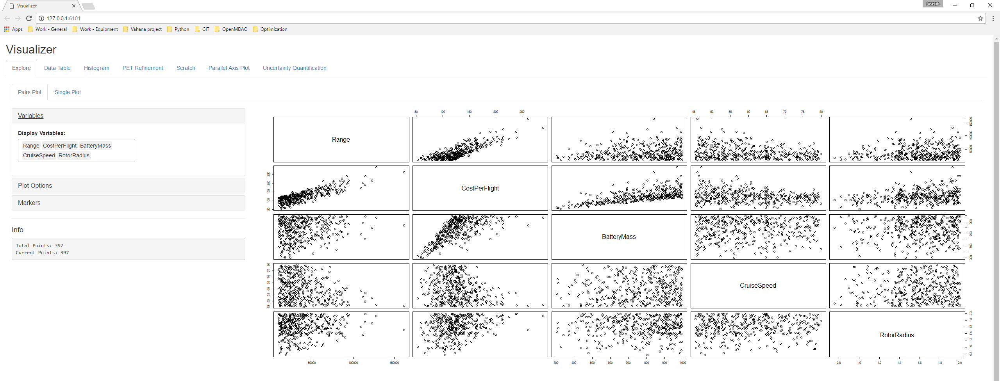

# OpenMETA-Vahana
An OpenMETA model for the conceptual design of an autonomous transport aircraft, inspired by the Vahana Project from A^3 by Airbus. The goal was to replicate the tradeoff study that was released by A^3. A CAD model has been added to supplement this analysis. This model has parametric rotation of the wings and canards, as well as changing total wing and canard length based on the design variable "rProp".

Figure 1 - Image of Creo Model [CENTER]

Project Vahana is an Airbus A^3 project to create a low-cost, single-passenger, electric VTOL aircraft. As part of their design process, Airbus conducted the Vahana Configuration Trade Study to examine two different configurations (an electric helicopter and an electric eight fan tilt-wing) using multidisciplinary design optimization (MDO). 

Airbus released the [MATLAB source code](https://github.com/VahanaOpenSource/vahanaTradeStudy) used in their [Vahana Configuration Trade Study](https://vahana.aero/vahana-configuration-trade-study-part-ii-1edcdac8ad93) on GitHub.

Here at MetaMorph, we wanted to see if we could set up the same MDO problem and solve it in OpenMETA. 

First, we converted Airbus's MATLAB Code into composable PythonWrapper Components which could then be used as 'building blocks' in the OpenMETA environment.

Figure 2 - PythonWrapper Components for Power and Mission Calculations

Note: In Figure 2, CruisePower has many exposed outputs. One the other hand, HoverPower has only five exposed outputs. When building/modifying a PythonWrapper Component, the user can decide which input/output variables to be exposed.

Figure 3 - PythonWrapper Components for Mass Calculations

Note: Constants Components allow the user to quickly provide constant values to a system. In Figure 3, Constants Components provide WingMass, WireMass, and CanardMass with unique design parameters

Figure 4 - PythonWrapper Components for Cost and Constraint Calculations

## Parameter Study
After converting the major MATLAB scripts in PythonWrapper Components, we added a Parameter Study Component to explore the available design space. Figure 5 shows the Parameter Study has 7 Design Variables on its left side and 8 Objectives on its right side.

Figure 5 - Parameter Study Component

Now we can set the ranges of the design variables in the Parameter Study Component and run the Master Interpreter to generate some data. Let's set the Parameter Study to 1 million samples and run the PET.

Here's a filtered subset of our data in the OpenMETA Visualizer - 397 points to be exact:

 <- Get a higher res image if possible

Figure 5 - Filtered PET Result in Visualizer

## References
[Vahana Configuration Trade Study Part - 1](https://vahana.aero/vahana-configuration-trade-study-part-i-47729eed1cdf)

[Vahana Configuration Trade Study Part - 2](https://vahana.aero/vahana-configuration-trade-study-part-ii-1edcdac8ad93)

[MATLAB Code](https://github.com/VahanaOpenSource/vahanaTradeStudy)
