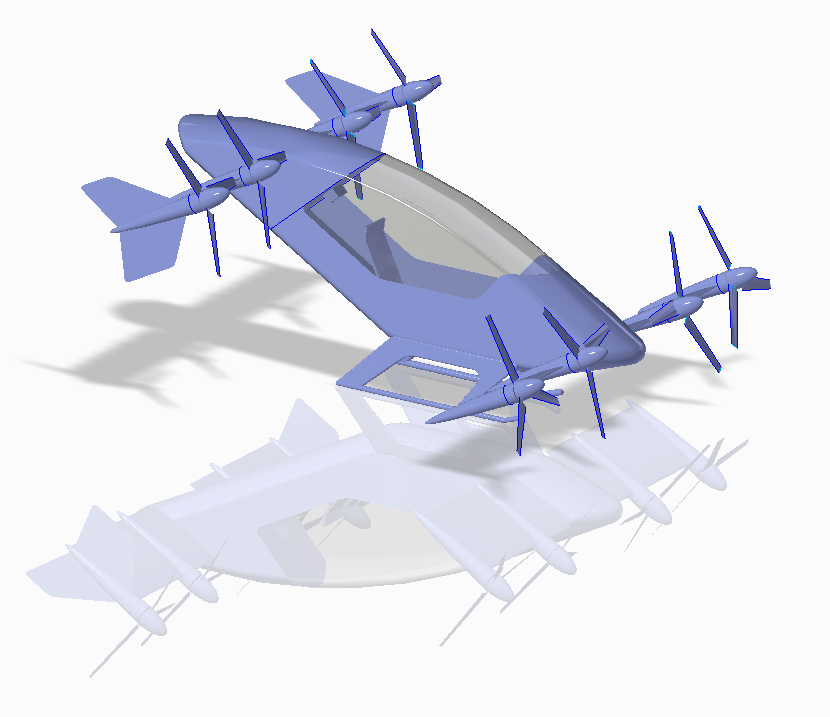

# OpenMETA-Vahana

**Figure 1** - OpenMETA Creo Model of a Possible Vahana Configuration


## Introduction

An OpenMETA model for the conceptual design of an autonomous transport aircraft, inspired by the Vahana Project from A³ by Airbus. The goal was to replicate the Vahana Configuration Trade Study released by A³ using OpenMETA. 

## Airbus Vahana Configuration Trade Study

Project Vahana is an Airbus A³ campaign to create a low-cost, single-passenger, electric VTOL aircraft. As part of their design process, Airbus conducted the Vahana Configuration Trade Study to better examine 2 different configurations (an electric helicopter and an electric eight fan tilt-wing) using multidisciplinary design optimization (MDO). 

- [A³ Vahana Configuration Trade Study - Part I](https://vahana.aero/vahana-configuration-trade-study-part-i-47729eed1cdf)
- [A³ Vahana Configuration Trade Study - Part II](https://vahana.aero/vahana-configuration-trade-study-part-ii-1edcdac8ad93)
- [A³ MATLAB source code](https://github.com/VahanaOpenSource/vahanaTradeStudy)

The A³ team set up a MDO sizing problem in which they compared an electric helicopter model and an electric eight fan tilt-wing model over a range of operating distances (10 km to 200 km in 10 km steps). At each distance, both vehicle models were optimized seperately for Direct Operating Cost (DOC) by varying 5 design variables: Cruise Speed, Rotor Radius, Battery Mass, and Takeoff Mass. The A³ team also provided the optimizer with 3 constraint equations (4 if the vehicle was a helicopter) that defined certain design requirements - e.g. The vehicle's effective energy capacity (Battery Mass * Battery Energy Density * Battery Discharge Depth) had to be greater than the amount of energy required to execute a reserve ("worst case") mission. 

This entire optimization process was executed via the following MATLAB scripts:  

- `sizingTradeStudy.m`  
- `computePerformance.m`  
- `simpleMission.m`  
- `reserveMission.m`  
- `cruisePower.m`  
- `hoverPower.m`  
- `loiterPower.m`  
- `configWeight.m`  
- `wingMass.m`  
- `wireMass.m`  
- `propMass.m`  
- `fuselageMass.m`  
- `operatingCost.m`  
- `costBuildup.m`  
- `toolingCost.m`  
- `materials.m`  

As a result of their Sizing Trade Study, the Vahana team concluded that an eight-fan, tilt-wing configuration would best meet their broad design requirements for a low-cost, single-passenger, electric VTOL aircraft.

## OpenMETA Vahana Configuration Trade Study 
Here at MetaMorph, we set out to first replicate the Vahana Configuration Trade Study's results using the OpenMETA toolset. Since OpenMETA is designed for Multidisciplinary Design Analysis and Optimization, we thought that it would be interesting to see if we could reproduce the A³ team's results using the OpenMETA toolset.

### Conversion of MATLAB Scripts to PythonWrapper Components

In order to set the problem up in OpenMETA, the relevant MATLAB scripts were first converted to PythonWrapper components. A PythonWrapper allows us to define an arbitrary block of Python code, e.g. a model, system, or calculation, with specific inputs and outputs. This PythonWrapper component can then be placed within an OpenMETA PET where the inputs and outputs are exposed as ports.

For example, the function `configWeight()` (defined within `configWeight.m`) is called within `computePerformance.m` in the Vahana Configuration Trade Study as seen below.

```Matlab
% Mass estimate  
mass = configWeight(vehicle,rProp,mBattery,mMoters,mtow,hoverOutput,cruiseOutput,payload);
```

We converted the `configWeight.m` script to a PythonWrapper component `config_weight.py` script. When this component is placed within an OpenMETA PET, a block appears representing the script with inputs and outputs on the left and right sides, respectively.

**Figure** - PythonWrapper Component in PET representing `config_weight.py`
  

For our purposes, the conversion from MATLAB to Python was not always exact. We had to find substitutes for many of the build-in MATLAB functions/constructs, and we took some liberties in recomposing parts of the problem to better fit within the OpenMETA architecture.  
For example, The MATLAB script 'configWeight.m' returns a single array of values. PythonWrapper components can also output arrays but in this case, we wanted the PythonWrapper 'ConfigWeight' to expose individual scalar values as its outputs.

In general, PythonWrapper components:

* are represented visually within OpenMETA
* can be easily connected to other components (just draw a line)
* can be modified, copied, or imported into other designs
* are fully-compatible with OpenMETA's underlying OpenMDAO engine

In combination with other OpenMETA components, Python wrappers are used as 'building blocks' in building larger systems and models within the Parametric Exploration Tool (PET) canvas.

<!--
...and the following disadvantages:

* The MATLAB scripts had to first be converted to Python
* It is easy to make mistakes when converting complex algorithms between languages
* Converting MATLAB scripts into PythonWrapper Components often changes the structure of the problem. For example, if you have a function x = foo(a, b) that calls another function y = bar(c).  
In MATLAB, you would have two files (foo.m and bar.m) and your data path would look like this:  
a,b -> foo -> c -> bar -> y -> foo -> x.  
a & b are passed into foo. foo passes c into bar. bar returns y to foo. foo returns x.  
However, for PythonWrapper Components (foo.py and bar.py) it often makes more sense to first pass c to bar. bar passes y to foo. a & b are also passed to foo. foo outputs x.  
c -> bar -> y -> foo -> x  
........................ a,b -^ -->

### OpenMETA Using a 'Parameter Study' Driver

<!-- Talk about composition and what a Parameter Study is.-->

After converting the major MATLAB scripts in PythonWrapper Components, we added a 'Parameter Study' driver to explore the available design space. The 'Parameter Study' driver allows the user to vary Design Variables (inputs) within defined ranges and record Objectives (outputs). In essence, the 'Parameter Study' driver allows the user to quickly explore the available design space and then view the results of that exploration via the OpenMETA PET Visualizer (or as a raw .csv).

**Figure 4** shows the Parameter Study placed within the larger PET. The Parameter Study is highlighted with a red box. All the other boxes are PythonWrapper Components or Constants Components. The Parameter Study contains 6 design variables - Vehicle, Rotor Radius, Cruise Speed, Battery Mass, Motor Mass, and Maximum Takeoff Weight (actually mass) - which it varies between defined lower and upper bounds (taken from sizingTradeStudy.m). For example, Battery Mass is varied betweed 10-999 kg. 

Note: The Tilt-Wing and Helicopter configuration have slightly different ranges for Rotor Radius and Cruise Speed, but for simplicity, those variables were set to cover the ranges of both configurations and extra constraint ouputs were added to check if the specific vehicle's design ranges were violated.

The 'Parameter Study' driver also contains several Objectives, which record system outputs - including DOC and the constraint functions - for each combination of Design Variables injected into the system.

**Figure** - 'Parameter Study' driver within Larger PET


Unfortunately, after the first few runs, we quickly realized that - due to the size of the available design space, the constraints, and the desire for a minimized value - a brute force design space exploration was too inefficient for this particular problem. We ran the Parameter Study for 1 million samples using a full factorial approach, but after filtering out the results that violated design constraints, we had only 397 valid designs - a yield rate of less than 0.04%. The valid designs are shown inside the OpenMETA PET Visualizer in **Figure 6**.

**Figure** - Parameter Study PET Results 


### OpenMETA Using an 'Optimizer' Driver

Fortunately, OpenMETA also has an 'Optimizer' driver that uses the COBYLA Optimizer. We replaced the 'Parameter Study' Driver with an 'Optimizer' driver and ran the PET again. The table below compares the results from an Optimizer PET to the results from the `tradeStudyResult.mat` file produced by the A³ Vahana Configuration Trade Study.

|                        | Range (km) | DOC ($) | DOC (km/$) | rProp (m) | cruiseSpeed (m/s) | batteryMass (kg) | motorMass (kg) | mtom (kg) |
|:----------------------:|:----------:|:-------:|:----------:|:---------:|:-----------------:|:----------------:|:--------------:|:---------:|
| OpenMETA |     100    |   96.9  |    0.97    |    0.71   |        47.2       |        352       |      42.9      |    567    |
|   Vahana Study   |     100    |  116.3  |    1.16    |    1.10   |        45.5       |        413       |      66.7      |    967    |

While the OpenMETA Optimizer obtained similar values, there are differences. In particular the maximum takeoff mass obtained by the Vahana Trade Study is almost twice the value of the Optimizer. The primary reason for this was several of the mass computation modules (wings, canards, fuselage, prop) were not connected at this time and instead the `config_weight.py` block was being supplied by constant values.

### 'Optimizer' PET Nested Within 'Parameter Study' PET

The OpenMETA 'Optimizer' produced reasonable results, and if that particular model were developed more, the differences between it and the Vahana Trade Study would shrink. However, what we really wanted to do was place an OpenMETA 'Optimizer' driver *inside* of an OpenMETA 'Parameter Study' driver - similar to the  Vahana team's approach of nesting a MATLAB `fmincon()` function within a high-level DoE - so that we could easily generate optimized designs over a range of operating distances from 10 km to 100 km.

While this functionality is not currently within OpenMETA, we were able build it (using all those PythonWrapper Components) directly on OpenMETA's underlying OpenMDAO framework and obtain some good proof-of-concept results. The figure below shows results from the Vahana Configuration Trade Study and the OpenMDAO Optimizer on the same graph. While there is obviously room for improvement in the current PythonWrapper components modeling the MDO problem, it is a good stepping stone towards replication.

**Figure** - Comparison of `vahana_optimizer.py` and `sizingTradeStudy.m` results


## 4. Improving the Vahana Configuration Trade Study / Future Plans
COMING SOON

## References
[Vahana Configuration Trade Study Part - 1](https://vahana.aero/vahana-configuration-trade-study-part-i-47729eed1cdf)
[Vahana Configuration Trade Study Part - 2](https://vahana.aero/vahana-configuration-trade-study-part-ii-1edcdac8ad93)
[MATLAB Code](https://github.com/VahanaOpenSource/vahanaTradeStudy)
