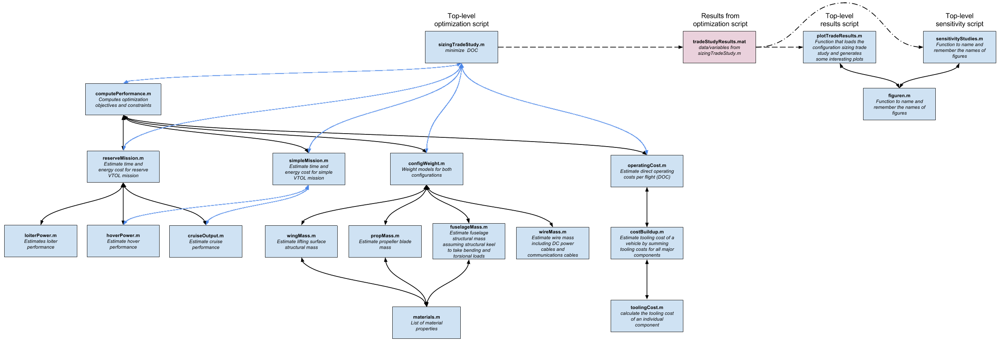

# OpenMETA-Vahana
An OpenMETA model for the conceptual design of an autonomous transport aircraft, inspired by the Vahana Project from A^3 by Airbus. The goal was to replicate the tradeoff study that was released by A^3. A CAD model has been added to supplement this analysis. This model has parametric rotation of the wings and canards, as well as changing total wing and canard length based on the design variable "rProp".

Figure 1 - Image of Creo Model [CENTER]

We converted the A^3's MATLAB Code to PythonWrapper Components which we then used as 'building blocks' in the OpenMETA environment. By transforming the problem presentation from a nested function structure into an exposed, linear, and modular structure, we gain the ability to easily swap out individual PythonWrapper Components and change connections between individual Components.

Figure 2 - A^3 MATLAB Code Structure [CENTER]

Figure 3 - A PET Composed of PythonWrapper Components [CENTER]

## References
[Vahana Configuration Trade Study Part - 1](https://vahana.aero/vahana-configuration-trade-study-part-i-47729eed1cdf)

[Vahana Configuration Trade Study Part - 2](https://vahana.aero/vahana-configuration-trade-study-part-ii-1edcdac8ad93)

[MATLAB Code](https://github.com/VahanaOpenSource/vahanaTradeStudy)
