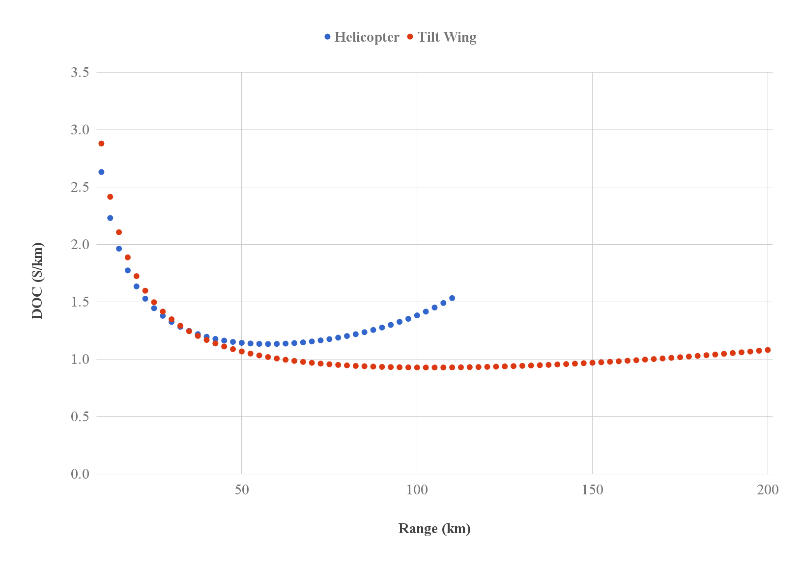

# OpenMETA-Vahana

**Table of Contents**
* [Summary](#summary)
* [Vahana Configuration Trade Study](vahana-configuration-trade-study)
* [OpenMETA Vahana Configuration Trade Study](openmeta-vahana-configuration-trade-study)
* [Getting Started with the OpenMETA Vahana Model](getting-started-with-the-openmeta-vahana-model)
  * [Installing OpenMETA](installing-openmeta)
  * [Cloning the openmeta-vahana repository](cloning-the-openmeta-vahana-repository)
  * [Opening the openmeta-vahana project](opening-the-openmeta-vahana-project)
  * [Viewing a PET model](viewing-a-pet-model)
  * [Running a PET model](running-a-pet-model)
  * [Viewing a PET model's results in the Visualizer](viewing-a-pet-model's-results-in-the-visualizer)
  * [PETs included in openmeta-vahana](pets-included-in-openmeta-vahana)
  * [Python Wrapper component scripts](python-wrapper-component-scripts)
  * [Documentation](documentation)
* [Future Plans](future-plans-/-improvements-to-vahana-configuration-trade-study)

## Summary
_An OpenMETA model for the conceptual design of an autonomous transport aircraft_

Inspired by the Vahana Project from A³ by Airbus, we built OpenMETA models of the Vahana Tilt-Wing Multirotor aircraft using A³'s publicly released source code as a template. 

A parametric CAD model of the Vahana was also built within OpenMETA with the goal of using CAD analysis to improve the accuracy of future studies. The most recent draft of this CAD model is shown below with its rotors angled to transition between the hover and cruise modes.

**Vahana CAD model:**
  

The OpenMETA models were used to perform similar DOC analyses to those in the Vahana Configuration Trade Study as well as improve on the original study. 

**OpenMETA 'Optimizer' Results and Vahana Trade Study Results for Tilt-Wing Configuration at Range of 100 km:**

|                        | DOC ($) | DOC (km/$) | rProp (m) | cruiseSpeed (m/s) | batteryMass (kg) | motorMass (kg) | mtom (kg) |
|:----------------------:|:-------:|:----------:|:---------:|:-----------------:|:----------------:|:--------------:|:---------:|
| OpenMETA |   116.3  |    1.16    |    1.10   |        45.5       |        413       |      66.7      |    968    |
|   Vahana Study   |  116.3  |    1.16    |    1.10   |        45.5       |        413       |      66.7      |    968    |

**OpenMETA PET model results:**

DOC vs. Range for Tilt Wing and Helicopter Configurations

DOC vs. Range for Tilt Wing Configuration with and without Fuel Weight Constraint

## A³ Vahana Configuration Trade Study
Project Vahana is an Airbus A³ campaign to create a low-cost, single-passenger, electric VTOL aircraft. As part of their design process, Airbus conducted the Vahana Configuration Trade Study to better examine 2 different configurations (an electric helicopter and an electric eight fan tilt-wing) using multidisciplinary design optimization (MDO). 

The A³ team set up a MDO sizing problem in which they compared an electric helicopter model and an electric eight fan tilt-wing model over a range of operating distances (10 km to 200 km in 10 km steps). At each distance, both vehicle models were optimized seperately for Direct Operating Cost (DOC) by varying 5 design variables: Cruise Speed, Rotor Radius, Battery Mass, and Takeoff Mass. The A³ team also provided the optimizer with 3 constraint equations (4 if the vehicle was a helicopter) that defined certain design requirements - E.g. the vehicle's effective energy capacity had to be greater than the amount of energy required to execute a reserve ("worst case") mission. 

As a result of their Sizing Trade Study, the Vahana team concluded that an eight-fan, tilt-wing configuration would best meet their broad design requirements for a low-cost, single-passenger, electric VTOL aircraft.

## OpenMETA Vahana Configuration Trade Study 
Here at MetaMorph, we set out to first replicate the Vahana Configuration Trade Study's results using the OpenMETA toolset. Since OpenMETA is designed for Multidisciplinary Design Analysis and Optimization, we thought that it would be interesting to see if we could reproduce the A³ team's results using the OpenMETA toolset.

To read about the OpenMETA Vahana Configuration Trade Study, check out our blog post.

To start working with the OpenMETA Vahana Model, check out the sections below.

## Getting Started with the OpenMETA Vahana Model

### Installing OpenMETA
1. Download the latest version of OpenMETA from https://www.metamorphsoftware.com/openmeta/.
1. Open the installer.
1. Agree to the license terms and conditions.
1. Left-click 'Install'.

*Note: If this is your first time using OpenMETA, we recommend that you complete the PET Tutorial to develop a basic understanding
of the tools!*

### Cloning the openmeta-vahana repository
1. Copy the following key onto your clipboard: `git@github.com:metamorph-inc/openmeta-vahana.git`
1. Open Git Bash in your desired project directory.
1. Run the following command in Git Bash: `git clone git@github.com:metamorph-inc/openmeta-vahana.git`

### Opening the openmeta-vahana project
1. Open the openmeta-vahana folder.
1. Double-click on the openmeta-vahana.xme file.
1. GME will open and display a pop-up 'Import to new project' window. Select 'Create project file' and click 'Next >'.
1. The 'Save As' window will open. Click 'Save' to save 'openmeta-vahana.mga' inside the openmeta-vahana folder

### Viewing a PET model
1. Within GME, to your right, there should be a 'GME Browser' window with a single 'RootFolder' object inside. Click on the '+'
to expand the root folder.
1. Left-click on the '+' next to 'Testing' to expand the testing folder.
1. Left-click on the '+' next to 'ParametricExploration' to expand the parametric exploration folder.
1. You should now see a number of PETs .
1. Within the GME Browser window, double-click on 'DEMOVahanaTiltWingPET' to open it. 

### Running a PET model
1. Left-click the CyPhy Master Interpreter button located on the top toolbar. 
1. The 'CyPhy Master Interpreter' window will open. Make sure 'Post to META Job Manager' is checked and left-click 'OK'.
1. The 'Results Browser' window will open. The running PET will be listed under the 'Active Jobs' tab. Blue means the Master Interpreter
is still running, red means the Master Interpreter failed, and green means that the Master Interpreter succeeded.
1. Once the DemoVahanaTiltWingPET finishes running, left-click the PET tab of the Results Browser.
1. Information from the PET run will be displayed to your right within the Results Browser window.

### Viewing a PET model's results in the Visualizer
1. Left-click the 'Launch in Visualizer' button in the bottom-right corner to view the results in the PET Visualizer.
1. The Visualizer will open in a browser window. Left-click the 'Explore>Single Plot' tab.
1. Under the 'Variables' section, set the X-Axis to 'Range' and the 'Y-Axis' to 'DOCPerKm'.

### PETs included in openmeta-vahana
The following PETs are included in the openmeta-vahana project in the `RootFolder>Testing>ParametricExploration` directory.

*Tilt Wing Configuration*  
DEMOVahanaTiltWingPET  
DEMOVahanaTiltWingPETExposedParameters  
DEMOVahanaTiltWingPETFuelWeightCon  
DEMOVahanaTiltWingPETHigherCruiseSpeed  
DEMOOrganizedVahanaTiltWingPET  
  
DEMOVahanaTiltWingOptimizerPET  
DEMOVahanaTiltWingOptimizerPETCostBreakdown  
DEMOVahanaTiltWingOptimizerPETMassBreakdown  
  
DEMOVahanaTiltWingParametricStudyPET  
  
*Helicopter Configuration*  
DEMOVahanaHelicopterPET  
DEMOVahanaHelicopterPETFuelWeightCon  
  
DEMOVahanaHelicopterOptimizerPET  
DEMOVahanaHelicopterOptimizerPETCostBreakdown  
DEMOVahanaHelicopterOptimizerPETMassBreakdown  

### Python Wrapper component scripts
All the Python Wrapper component scripts used to build the openmeta-vahana PETs are located in the `openmeta-vahana/scripts` folder. We encourage you to compare them with the A³ MATLAB scripts. To learn more, check out OpenMETA's Python Wrapper documentation as well as [OpenMDAO's documentation](http://openmdao.readthedocs.io/en/1.7.3/).

### Documentation
For additional information regarding the OpenMETA toolset, please consult the [documentation](http://docs.metamorphsoftware.com/doc/index.html).

Quick links:
#TODO: Add some quick links here / or scrap the Quick links section entirely

## Future Plans / Improvements to Vahana Configuration Trade Study
Since we were able to produce similar trends to those in the Vahana Configuration Trade Study using OpenMETA, we wanted to explore ways in which to improve on the Trade Study's results. Outside of exercising the OpenMETA toolset, there was little reason to recreate the Vahana Configuration Trade Study - it had already served its purpose and Airbus had already progressed to the next stage in the design process. Therefore, our next goal was to see how we could improve the Trade Study's model and provide more detailed anaylsis for design purposes.

### Meta-Link CAD Model
A CAD model can provide a more accurate representation of a vehicle's geometry, mass, and mass distribution. In creating a CREO model of the Tilt-Wing Configuration, we hoped to provide a more model that could eventually be used to calculate mass, center of gravity, and production costs.

The model (shown below) is based on the sketches of the Tilt-Wing configuration that A³ released in the Vahana Trade Study Report. This model is composed within GME and contains parametric features that align with the design requirements outlined within the Vahana Trade Study's MATLAB code. The rotational orientation of the wings and canards can be varied between the cruise and hover positions (or 0-90 degrees).

**Vahana in hover mode:**

**Vahana transitioning from hover mode to cruise mode:**

**Vahana in cruise mode:**

The model assembly is located at `RootFolder/ComponentAssemblies/Vahana2` within openmeta-vahana.xme. By changing the values of the `Canard_Rotation` and `Wing_Rotation` parameters, a user can be change the orientation for a specific analysis. The `rProp` parameter allows the user to change vary the length of the propeller blades. Changing the propeller blade radius also changes the span of both flight surfaces as well as the positions of the rotors in order to maintain an appropriate spacing between the neighboring rotors.

### xFOIL Integration
Work in progress...

### Iterative Mass Calculations
When running the PET 'Parameter Study' we noticed that the low success rate of less than 0.04% was primarily caused by designs failing the first two design constraints:

* The vehicle battery must contain more energy than the energy required to complete its mission 
* The vehicle motors must the capacity to provide at least 1.7 times the maximum power required for hover mode

The Vahana Trade Study set battery mass and motor mass as design variables while using assumed values for battery specific energy and motor specific power. Since 95% of all 'Parameter Study' PET runs failed as a result of the first two constraints, we looked into making battery mass and motor mass dependent variables which could be solved using an iterative method and the other design variables.

Using Euler's linear method of numerical integration (method shown [here](https://docs.google.com/spreadsheets/d/170VYNoF4OTg8ZG605DoPC1EO5k4rxNIF8a00Ac6IGiI/edit?usp=sharing)) the required battery mass and motor mass can be solved for within 0.01% of the theoretical value in 10 interation for ranges up to ten times larger than the assumed payload of 150 kg. A future model may implement these mass calculations in order to more intelligently explore the design space

<!-- Image isn't in images/ ...

Image of Mass Convergence at 1500 kg

-->

## References
[A³ Vahana Configuration Trade Study Part - 1](https://vahana.aero/vahana-configuration-trade-study-part-i-47729eed1cdf)  
[A³ Vahana Configuration Trade Study Part - 2](https://vahana.aero/vahana-configuration-trade-study-part-ii-1edcdac8ad93)  
[A³ MATLAB Code](https://github.com/VahanaOpenSource/vahanaTradeStudy)
